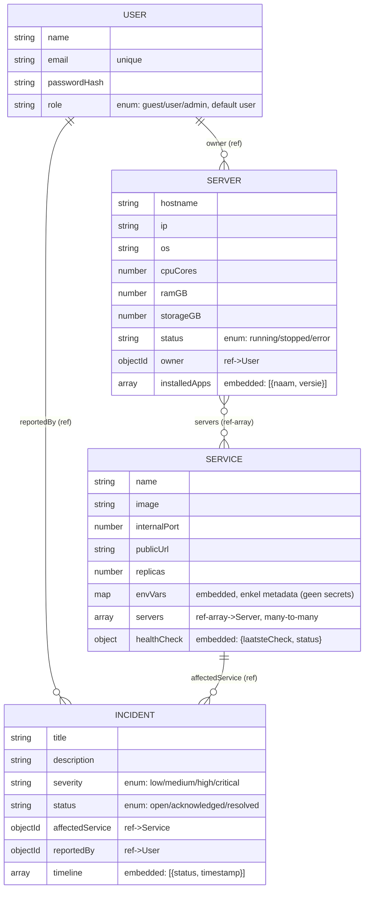

# Datamodel — Homelab Beheer API

Vier collecties, allemaal met minstens één relatie (geen losstaande collecties) — zie sectie 9 van de cursusgids voor de embed-vs-reference-regels.

## 1. ER-diagram

Opmerking bij de relatie Server ↔ Service: er staat **geen** omgekeerde `services`-array op Server. De many-to-many wordt enkel via `Service.servers` bijgehouden; services van een server vraag je op met `Service.find({ servers: serverId })`.

## 2. Embed vs Reference

Per relatie de motivatie, volgens sectie 9 (embedded by default; reference enkel met sterke reden: eigen levenscyclus, many-to-many of onbeperkte groei).

**Server.installedApps → embedded.** Een geïnstalleerde app bestaat niet los van de server: hij wordt nooit apart opgevraagd of bewerkt en groeit beperkt. Embedding levert één database-call op in plaats van een populate (sectie 9: "de data hoort altijd samen bij het hoofddocument").

**Service.envVars → embedded.** Omgevingsvariabelen zijn puur metadata die alleen in de context van de service betekenis hebben, en de set is klein en overzichtelijk. Belangrijk: de `envVars`-map bevat **geen secrets van gehoste applicaties** (geen API-keys, wachtwoorden of tokens) — echte geheimen horen in een secrets-manager, niet in de database. Enkel metadata als `NODE_ENV`, domeinnamen of image-tags.

**Service.healthCheck → embedded.** De laatste health-check is één onveranderlijk statusmoment dat altijd bij de service hoort. Er is nooit een reden om hem los van de service te bevragen, dus een aparte collectie zou alleen maar een extra `populate()` en een kans op inconsistentie opleveren.

**Incident.timeline → embedded.** De statuswissels (open → acknowledged → resolved) vormen een chronologisch log dat bij het incident hoort en beperkt groeit (elke incident heeft hooguit een handvol statuswissels). Aparte collectie zou niks opleveren; embedded krijg je het hele verhaal van een incident in één read.

**User → Server/Incident (owner/reportedBy) → reference.** Users hebben een **eigen levenscyclus** (registratie, wachtwoordwijziging, rol) die volledig los staat van servers en incidenten, en ze worden onafhankelijk beheerd. Referencing voorkomt dat elk Server/Incident-document de hele userdata dupliceert.

**Server ↔ Service (Service.servers) → reference (many-to-many).** Één service draait op meerdere servers (high availability), één server host meerdere services. Een `servers`-array van ObjectIds is de klassieke many-to-many-aanpak: embedding zou betekenen dat elke service de volledige serverdocumenten bevat, en het omgekeerde ook — dat wordt onbeperkt groot en raakt gegarandeerd inconsistent bij updates (sectie 9: "embedding het document onbeperkt zou laten groeien").

**Incident → Service/User (affectedService/reportedBy) → reference.** Incidenten hebben een eigen levenscyclus (melding → opvolging → resolutie) en worden typisch apart van de service/user opgevraagd en bewerkt. Referencing laat toe dat een incident blijft bestaan (als historisch log) zelfs als de service ondertussen verwijderd of hernoemd is.
